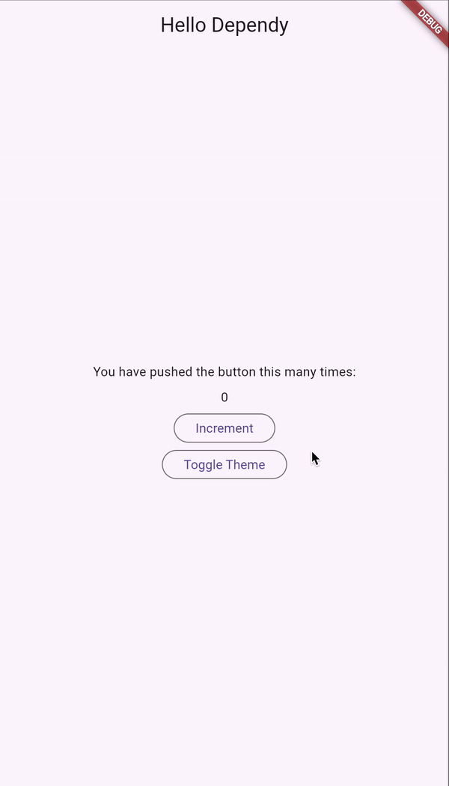

# Injecting UI Elements

This example illustrates how to use `dependy` for injecting UI elements through Dependency Injection. This approach is
particularly useful when developing apps with different flavors, where each flavor may provide distinct `dependy`
modules with varying behaviors. In the example below, we demonstrate how to inject and retrieve different widgets via
Dependency Injection, enabling a seamless switch between Cupertino and Material widgets. Other potential use cases
include variations for free and paid versions, among others.



---

### Main Application Setup

```dart
import 'package:dependy/dependy.dart';
import 'package:flutter/material.dart';
import 'ui/ui.dart';

late final EagerDependyModule _materialModuleSync;
late final EagerDependyModule _cupertinoModuleSync;

Future<void> _initializeUIModule() async {
  _materialModuleSync = await materialModule.asEager();
  _cupertinoModuleSync = await cupertinoModule.asEager();
}

Future<void> main() async {
  await _initializeUIModule();
  runApp(const MyApp());
}
```

- **Dependencies**: We import the `dependy` package for Dependency Injection (DI), `material.dart` for Material widgets,
  and `ui/ui.dart` for our custom theme abstractions.

- **Eager Dependency Loading**: We define two variables (`_materialModuleSync` and `_cupertinoModuleSync`) for the
  eagerly loaded theme modules. These will hold the theme configuration and injected widgets for Material and Cupertino,
  respectively.

- **`_initializeUIModule` Function**: This function initializes both the Material and Cupertino theme modules using
  `asEager()`. `asEager()` ensures that the theme modules are fully loaded and ready before the app starts.

- **`main()` Function**: The `main()` function runs asynchronously, first initializing the theme modules and then
  launching the Flutter app with `MyApp`.

---

### **`MyApp` Widget: Centralizing Theme Switching**

```dart
class MyApp extends StatefulWidget {
  const MyApp({super.key});

  @override
  State<MyApp> createState() => _MyAppState();
}

final homeKey = GlobalKey();

class _MyAppState extends State<MyApp> {
  var uiModule = _materialModuleSync;

  @override
  Widget build(BuildContext context) {
    return WThemeProvider(
      child: Builder(
        builder: (context) {
          final ui = WThemeProvider.of(context);
          return ui<WApp>()(
            title: 'Flutter Demo',
            home: MyHomePage(
              key: homeKey,
              title: 'Flutter Demo Home Page',
              toggleTheme: () {
                setState(() {
                  if (uiModule == _cupertinoModuleSync) {
                    uiModule = _materialModuleSync;
                  } else {
                    uiModule = _cupertinoModuleSync;
                  }
                });
              },
            ),
          );
        },
      ),
      themeModule: uiModule,
    );
  }
}
```

- **Stateful Widget**: `MyApp` is a `StatefulWidget`, as the app’s theme changes dynamically, and it needs to rebuild
  when the theme is toggled.

- **Theme Management**: The `uiModule` state variable holds the current theme module. Initially, it is set to
  `_materialModuleSync` (Material theme).

- **`WThemeProvider`**: This widget provides the theme context (`themeModule`) to its descendants. Inside the `Builder`,
  we access the current theme using `WThemeProvider.of(context)`.

- **UI Injection**: The `WApp` widget is injected dynamically based on the current theme. It creates either a
  `CupertinoApp` or a `MaterialApp` depending on the `uiModule`.

- **Theme Toggle**: The `toggleTheme` function switches between the Material and Cupertino themes, updating the
  `uiModule` state. The theme switch causes a rebuild of the app with the new theme.

---

### **`MyHomePage`: The Main Page UI**

```dart
class MyHomePage extends StatefulWidget {
  const MyHomePage({
    super.key,
    required this.title,
    required this.toggleTheme,
  });

  final String title;
  final VoidCallback toggleTheme;

  @override
  State<MyHomePage> createState() => _MyHomePageState();
}

class _MyHomePageState extends State<MyHomePage> {
  int _counter = 0;

  void _incrementCounter() {
    setState(() {
      _counter++;
    });
  }

  @override
  Widget build(BuildContext context) {
    final ui = WThemeProvider.of(context);
    return ui<WScaffold>()(
      appBar: ui<WAppBar>()(title: "Hello Dependy"),
      body: Center(
        child: Column(
          mainAxisAlignment: MainAxisAlignment.center,
          children: [
            const Text(
              'You have pushed the button this many times:',
            ),
            SizedBox(
              height: 8.0,
            ),
            Text(
              '$_counter',
            ),
            SizedBox(
              height: 8.0,
            ),
            ui<WButton>()(
              title: "Increment",
              onPressed: () {
                _incrementCounter();
              },
            ),
            SizedBox(
              height: 8.0,
            ),
            ui<WButton>()(
              title: "Toggle Theme",
              onPressed: widget.toggleTheme,
            ),
          ],
        ),
      ),
    );
  }
}
```

- **Stateful Widget**: `MyHomePage` is another `StatefulWidget` that holds the main content of the app, including a
  counter that can be incremented and a button to toggle the theme.

- **UI Injection**: Similar to `MyApp`, `MyHomePage` uses `WThemeProvider.of(context)` to access the current theme.
  Based on the theme, it dynamically injects UI components such as `WScaffold`, `WAppBar`, and `WButton`.

- **Counter and Buttons**: The `_counter` variable tracks the number of times the button has been pressed. The buttons
  use the dynamically injected `WButton` widget (either Cupertino or Material).

---

### **`ui.dart`: Theme Abstractions and Dependency Injection**

The `ui.dart` file defines the abstraction layer for different UI components (such as `WApp`, `WScaffold`, `WAppBar`,
and `WButton`) and provides both Material and Cupertino implementations.

```dart
// region WApp
abstract class WApp {
  Widget call({
    required String title,
    required Widget home,
  });
}
```

- **`WApp`**: This is an abstract class that defines the structure for creating a `CupertinoApp` or a `MaterialApp`. The
  `call` method is implemented by the concrete classes `WAppCupertino` and `WAppMaterial`, which return the respective
  `CupertinoApp` or `MaterialApp` widget with the provided `title` and `home` widget.

```dart
class WAppCupertino extends WApp {
  @override
  Widget call({
    required String title,
    required Widget home,
  }) {
    return CupertinoApp(
      title: title,
      home: home,
    );
  }
}

class WAppMaterial extends WApp {
  @override
  Widget call({
    required String title,
    required Widget home,
  }) {
    return MaterialApp(
      title: title,
      home: home,
    );
  }
}
```

- **`WScaffold`**: This abstract class defines a scaffold layout for the app. Both `WScaffoldCupertino` and
  `WScaffoldMaterial` provide their own implementation of the scaffold for Cupertino and Material UIs, respectively.

```dart
class WScaffoldCupertino extends WScaffold {
  @override
  Widget call({
    required PreferredSizeWidget appBar,
    required Widget body,
  }) {
    return CupertinoPageScaffold(
      navigationBar: appBar as ObstructingPreferredSizeWidget,
      child: body,
    );
  }
}

class WScaffoldMaterial extends WScaffold {
  @override
  Widget call({
    required PreferredSizeWidget appBar,
    required Widget body,
  }) {
    return Scaffold(
      appBar: appBar,
      body: body,
    );
  }
}
```

- **`WAppBar`**: This abstract class defines an app bar for the application. It is implemented by `WAppBarCupertino` and
  `WAppBarMaterial`, which return their respective `CupertinoNavigationBar` or `AppBar` widgets.

```dart
class WAppBarCupertino extends WAppBar {
  @override
  PreferredSizeWidget call({required String title}) {
    return CupertinoNavigationBar(
      middle: Text(title),
    );
  }
}

class WAppBarMaterial extends WAppBar {
  @override
  PreferredSizeWidget call({
    required String title,
  }) {
    return AppBar(
      title: Text(title),
    );
  }
}
```

- **`WButton`**: This abstract class defines a button for the app. `WButtonCupertino` and `WButtonMaterial` provide
  implementations for a `CupertinoButton` and a `Material ElevatedButton`, respectively.

```dart
class WButtonCupertino extends WButton {
  @override
  Widget call({
    required String title,
    required VoidCallback onPressed,
  }) {
    return CupertinoButton(
      onPressed: onPressed,
      child: Text(title),
    );
  }
}

class WButtonMaterial extends WButton {
  @override
  Widget call({
    required String title,
    required VoidCallback onPressed,
  }) {
    return ElevatedButton(
      onPressed: onPressed,
      child: Text(title),
    );
  }
}


```

---

### **Dependy Modules**

```dart

final cupertinoModule = DependyModule(
  providers: {
    DependyProvider<WApp>(
          (dependencies) => WAppCupertino(),
    ),
    DependyProvider<WScaffold>(
          (dependencies) => WScaffoldCupertino(),
    ),
    DependyProvider<WButton>(
          (dependencies) => WButtonCupertino(),
    ),
    DependyProvider<WAppBar>(
          (dependencies) => WAppBarCupertino(),
    ),
  },
);

final materialModule = DependyModule(
  providers: {
    DependyProvider<WApp>(
          (dependencies) => WAppMaterial(),
    ),
    DependyProvider<WScaffold>(
          (dependencies) => WScaffoldMaterial(),
    ),
    DependyProvider<WButton>(
          (dependencies) => WButtonMaterial(),
    ),
    DependyProvider<WAppBar>(
          (dependencies) => WAppBarMaterial(),
    ),
  },
);
```

- **`DependyModule`**: Each theme (Material and Cupertino) is defined within a `DependyModule`. A module holds the
  providers for the different UI components (`WApp`, `WScaffold`, `WButton`, `WAppBar`) and associates each component
  with its respective implementation (Material or Cupertino).

---

### **`WThemeProvider`**

```dart
class WThemeProvider extends InheritedWidget {
  const WThemeProvider({
    super.key,
    required super.child,
    required this.themeModule,
  });

  final EagerDependyModule themeModule;

  @override
  bool updateShouldNotify(WThemeProvider old) {
    return old.child != child || old.themeModule != themeModule;
  }

  static EagerDependyModule of(BuildContext context) {
    final result = context.dependOnInheritedWidgetOfExactType<WThemeProvider>();

    if (result == null) throw Exception('No WThemeProvider found in context');

    return result.themeModule;
  }
}
```

- **`WThemeProvider`**: This custom `InheritedWidget` provides the current theme (in the form of a `themeModule`) to all
  widgets in the widget tree. It allows for easy access to the current theme in the entire app by using the
  `of(context)` method.

--- 

### Override providers

In this example, we demonstrate how to use `DependyModule` to override specific widget providers, allowing us to
customize parts of the app without modifying the base UI code (like the `ui.dart` file). This approach is especially
useful for scenarios where we want to replace or extend functionality dynamically, such as swapping out default widgets
or behavior for a customized version.

### Code Implementation

```dart
class MyButton extends WButton {
  @override
  Widget call({
    required String title,
    required VoidCallback onPressed,
  }) {
    return OutlinedButton(
      onPressed: onPressed,
      child: Text(title),
    );
  }
}

late final EagerDependyModule _materialModuleSync;
late final EagerDependyModule _cupertinoModuleSync;

Future<void> _initializeUIModule() async {
  final extendedMaterialModule = DependyModule(
    providers: {
      DependyProvider<WButton>(
            (dependencies) => MyButton(),
      ),
    },
    modules: {
      materialModule,
    },
  );

  _materialModuleSync = await extendedMaterialModule.asEager();
  _cupertinoModuleSync = await cupertinoModule.asEager();
}
```

### Explanation in Points

**Custom Widget Implementation**:

- We define a custom `MyButton` class that extends `WButton`. In this custom implementation, the `call` method returns a
  `OutlinedButton` instead of the default `ElevatedButton`. This allows us to change the appearance and behavior of
  buttons in the Material theme dynamically.

**Overriding Providers**:

- Using `DependyProvider`, we override the provider for the `WButton` widget in the `DependyModule`. By doing so, we
  ensure that the custom `MyButton` is used whenever the app requests a `WButton` in the Material theme.

**Extending an Existing Module**:

- The `extendedMaterialModule` is created by extending the existing `materialModule` with our custom `MyButton`
  provider. This ensures that the rest of the widgets (such as `WApp`, `WScaffold`, `WAppBar`) retain their default
  behavior, while only the `WButton` provider is overridden.

**Asynchronous Initialization**:
- The `extendedMaterialModule` is converted into an eager-loaded module using `asEager()`. This ensures that the module
  is fully loaded and ready to be used before the app starts. The `cupertinoModule` is also eagerly loaded in a similar
  manner.
